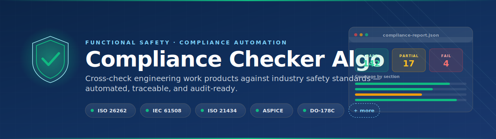
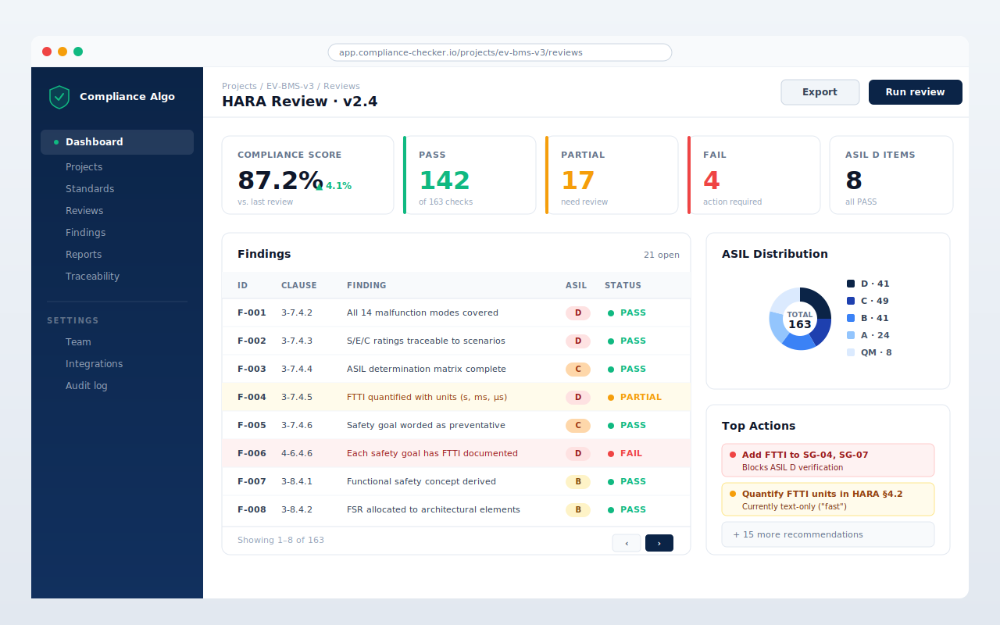
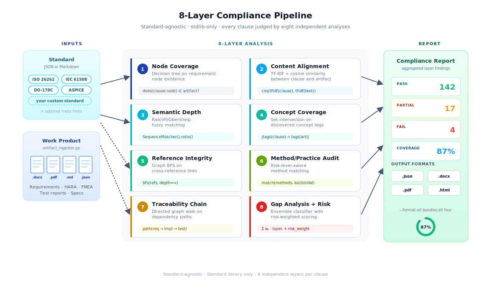

  

<h1 align="center">Standard-Agnostic Compliance Checker</h1>

  <strong><i>Feed it any safety standard. Feed it any work product. Get a compliance report.</i></strong>

  An 8-layer algorithm that checks any document against any standard &mdash; 
  no hardcoded rules, no domain lock-in, no manual cross-referencing.

  
  
  
  
  
  

 

What it does
Give it a safety standard (JSON or Markdown) and a work product (DOCX, PDF, TXT, JSON, MD). It runs eight analysis layers and tells you exactly where you're compliant, where you're not, and what's missing.

The engine is standard-agnostic. It auto-discovers the schema of whatever you throw at it — ISO 26262, IEC 61508, DO-178C, ASPICE, or a standard that doesn't exist yet.

 
What it looks like

  

 
The 8-layer pipeline

  

#LayerMethod1Node CoverageDecision tree on requirement node existence2Content AlignmentTF-IDF + cosine similarity3Semantic DepthRatcliff/Obershelp fuzzy matching4Concept CoverageSet intersection on discovered concept tags5Reference IntegrityGraph BFS on cross-reference links6Method/Practice AuditRisk-level-aware method matching7Traceability ChainDirected graph walk on dependency paths8Gap Analysis + RiskEnsemble classifier with risk-weighted scoring
 
Quick start
bash# Clone
git clone https://github.com/jherrodthomas/compliance-checker-algo.git
cd compliance-checker-algo

# Install Python dependencies (standard library only — no pip install needed)

# Run with synthetic example data
python agnostic_engine.py examples/synthetic_standard examples/synthetic_artifact.json \
  --meta examples/synthetic_meta.json

# Run with your own standard and work product
python agnostic_engine.py /path/to/your/standard /path/to/your/artifact.docx --format all
 
Output formats
--format json    →  Structured JSON report
--format docx    →  Word document with styled sections
--format pdf     →  PDF with visual compliance dashboard
--format html    →  Interactive HTML report
--format all     →  All of the above
 
Using your own standards

Standards are copyrighted. This repo includes only synthetic example data.
See STANDARDS_NOTICE.md for where to purchase real standards.

The engine accepts standards as JSON files following this schema:
json{
  "part": "3",
  "title": "Concept phase",
  "clauses": [
    {
      "section": "6.1",
      "title": "Hazard analysis",
      "type": "requirement",
      "text": "A hazard analysis shall be performed...",
      "tags": ["HARA", "hazard analysis"],
      "asil_level": "all",
      "notes": ["..."],
      "cross_references": ["5.1"]
    }
  ]
}
Or as Markdown files (converted from PDF via --convert flag).
An optional compliance_meta.json provides schema hints to accelerate discovery — but the engine works without it.
 
Project structure
├── agnostic_engine.py          # Core 8-layer compliance engine
├── artifact_ingester.py        # Normalizes DOCX/PDF/MD/TXT/JSON artifacts
├── markdown_parser.py          # Converts Markdown standards to engine JSON
├── report_generator.py         # JSON report output
├── report_generator_docx.py    # Word document report output
├── report_generator_html.py    # Interactive HTML report output
├── ISO26262_Checker.py         # Legacy ISO 26262-specific checker
├── compliance_meta.json        # Example meta-config (schema hints)
├── examples/                   # Synthetic test data (no proprietary content)
│   ├── synthetic_standard/     # Fictional 4-part safety standard
│   ├── synthetic_artifact.json # Fictional work product
│   └── synthetic_meta.json     # Meta-config for the synthetic standard
├── main.js                     # Electron desktop app entry
├── renderer/                   # Desktop app UI
└── STANDARDS_NOTICE.md         # Licensing info for real standards
 
Desktop app
The project includes an Electron wrapper (main.js, renderer/, preload.js) that packages the engine as a desktop application. To run it:
bashnpm install
npm start
Build scripts for Windows are in build_app.bat / build_engine.bat.
 
License
MIT — see LICENSE.
The compliance engine code is open source. The standards it checks against are not. See STANDARDS_NOTICE.md.
 

  Built by <a href="https://github.com/jherrodthomas">Jherrod Thomas</a>

